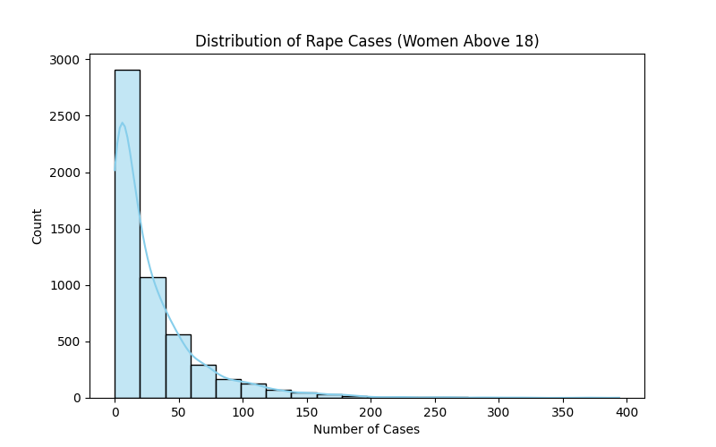
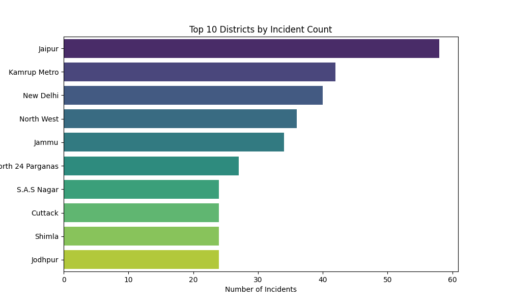
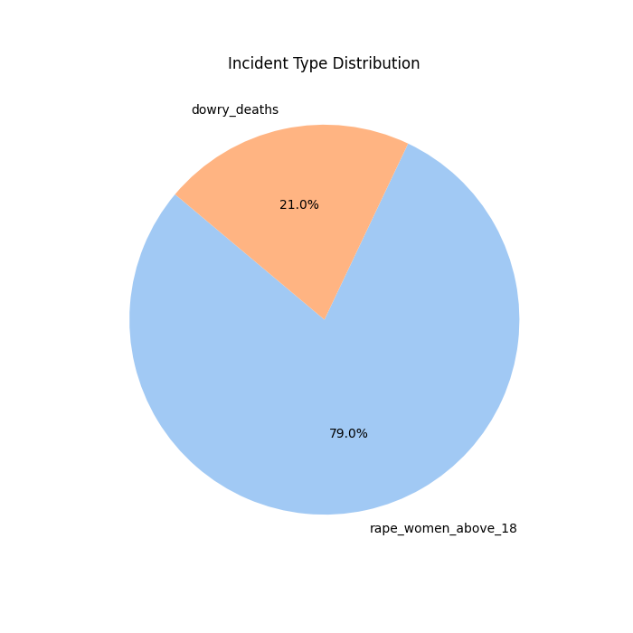
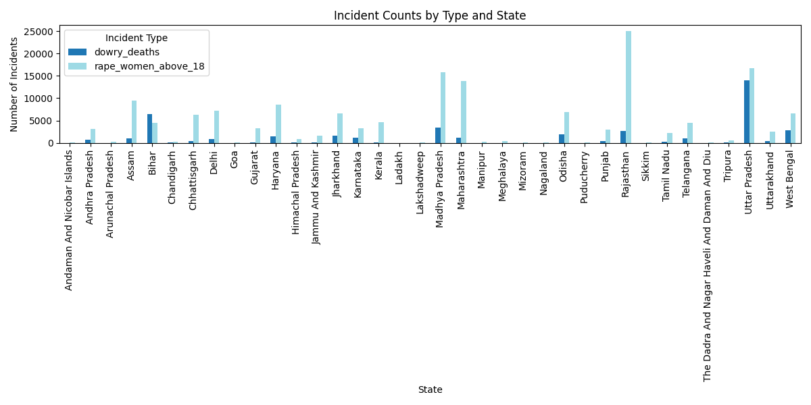
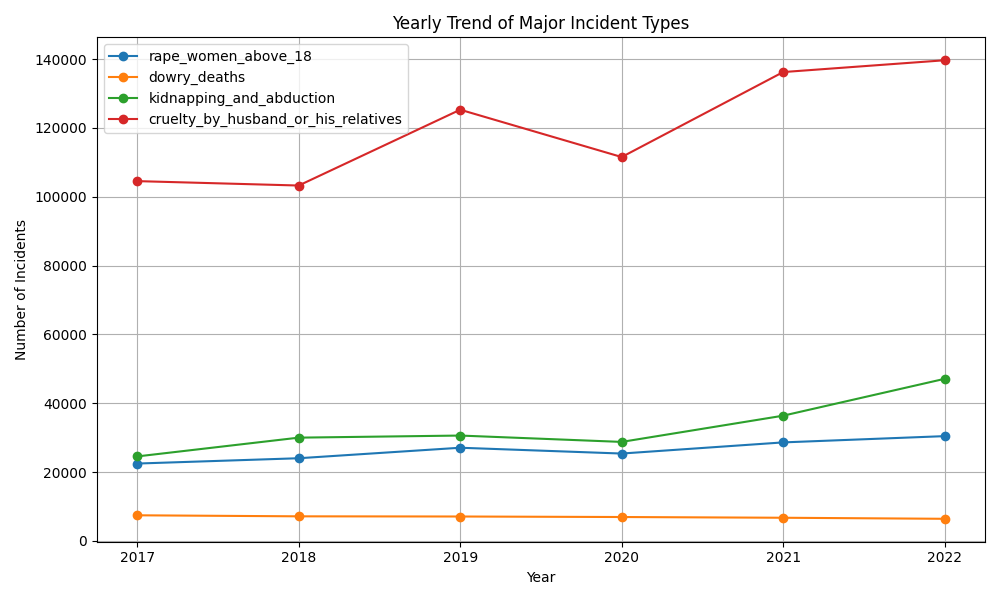
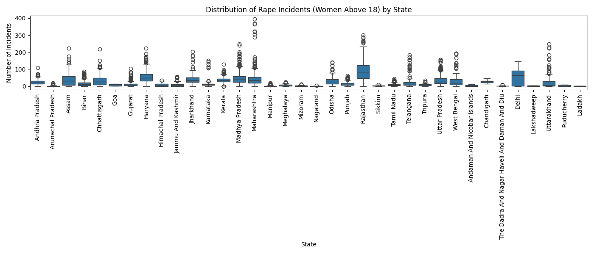
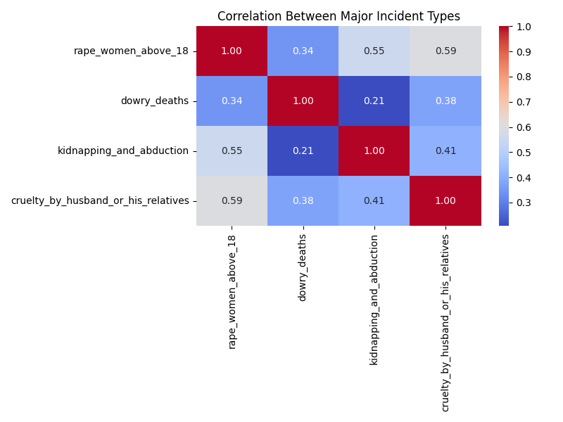
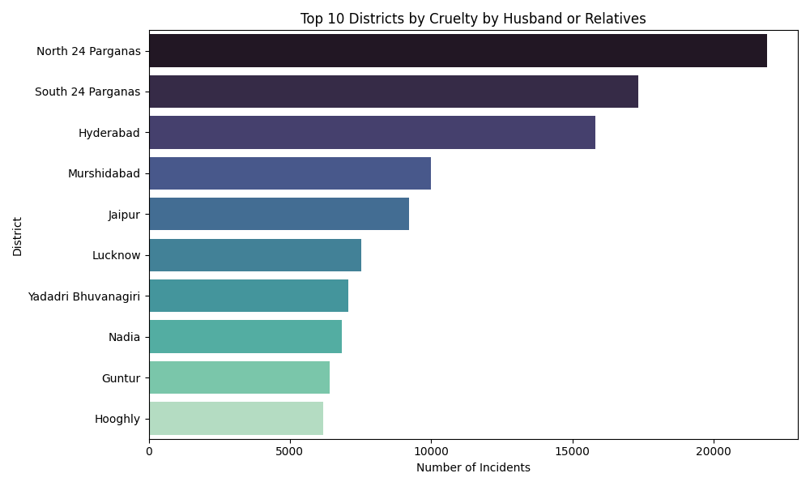
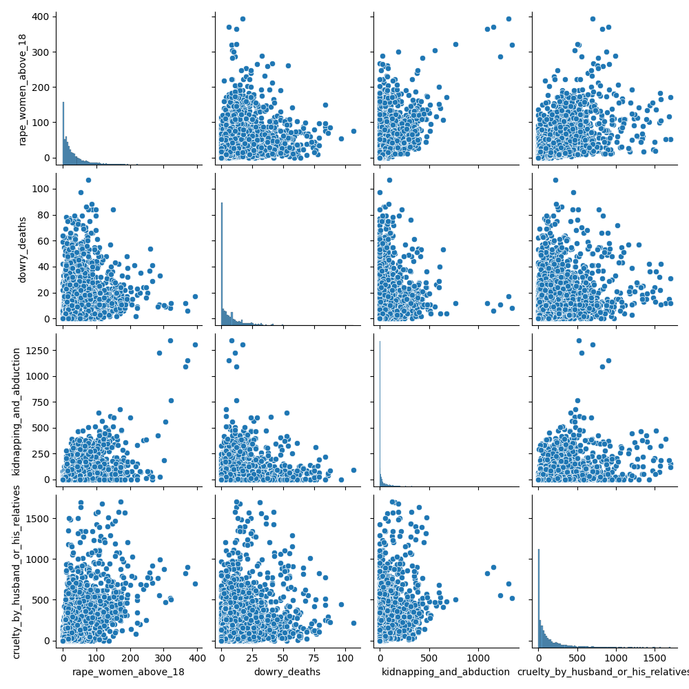

# Safe Women Project: Exploratory Data Analysis (EDA)

## Overview
This project analyzes crime data against women in India using the dataset `22070521075_CA1_EDA.csv`. The analysis focuses on key incident types, trends, and regional patterns to provide actionable insights for safety and policy interventions.

## Dataset
- **Source:** `dataset/22070521075_CA1_EDA.csv`
- **Columns Used for Analysis:**
  - `year`, `state_name`, `district_name`
  - `rape_women_above_18`, `dowry_deaths`, `kidnapping_and_abduction`, `cruelty_by_husband_or_his_relatives`

## Data Cleaning
- Selected relevant columns for focused analysis.
- Dropped rows with missing values in these columns.
- Saved the cleaned dataset as `dataset/clean_dataset.csv`.

## Exploratory Data Analysis (EDA)

### 1. Distribution of Rape Cases (Women Above 18)
- **Visualization:** Histogram
- **Purpose:** Shows the distribution of rape cases involving women above 18 across districts/years.
- **Interpretation:** Peaks indicate districts/years with higher incident frequency.

### 2. Top 10 Districts by Incident Count
- **Visualization:** Bar Plot
- **Purpose:** Highlights districts with the highest number of incidents.
- **Interpretation:** Identifies hotspots for targeted interventions.

### 3. Incident Type Distribution
- **Visualization:** Pie Chart
- **Purpose:** Shows the proportion of selected incident types (rape of women above 18 and dowry deaths).
- **Interpretation:** Highlights the most common types among those available.

### 4. Incident Counts by Type and State
- **Visualization:** Grouped Bar Plot
- **Purpose:** Compares the number of incidents for each type across states.
- **Interpretation:** Reveals which states have higher rates for specific crimes.

### 5. Yearly Trend of Major Incident Types
- **Visualization:** Line Plot
- **Purpose:** Shows how the number of major incident types has changed over the years.
- **Interpretation:** Identifies increasing or decreasing trends for each type.

### 6. State-wise Comparison of Rape Incidents
- **Visualization:** Boxplot
- **Purpose:** Visualizes the spread and outliers of rape incidents across states.
- **Interpretation:** Highlights states with higher median or extreme values.

### 7. Correlation Between Major Incident Types
- **Visualization:** Heatmap
- **Purpose:** Shows the correlation between different incident types.
- **Interpretation:** Strong correlations may indicate related social issues or reporting patterns.

### 8. Top 10 Districts by Cruelty by Husband or Relatives
- **Visualization:** Horizontal Bar Plot
- **Purpose:** Highlights districts with the highest number of cruelty incidents.
- **Interpretation:** Helps focus interventions on specific locations.

### 9. Pairwise Relationships Between Incident Types
- **Visualization:** Pairplot (Scatter Matrix)
- **Purpose:** Shows the pairwise relationships between major incident types.
- **Interpretation:** Reveals possible linear or non-linear associations.

## How to Run
1. Open `EDA.ipynb` in Jupyter or VS Code.
2. Run each cell in order to reproduce the analysis and visualizations.
3. The cleaned dataset is saved as `dataset/clean_dataset.csv` for further modeling or analysis.

## Images
All visualizations are generated in the notebook. To save images, right-click on each plot and save as PNG/JPG for use in presentations or reports.

## Summary
- The analysis provides a comprehensive view of crime patterns against women.
- Visualizations help identify trends, hotspots, and relationships between incident types.
- The clean dataset can be used for further predictive modeling or policy research.

---
**Contact:** For questions or collaboration, please reach out to the project maintainer.
